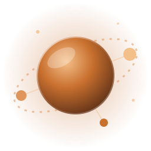
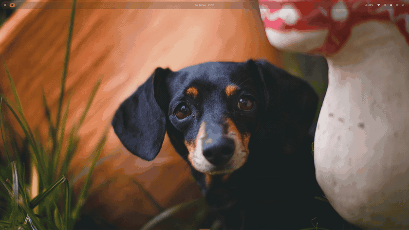

<p align="center">
  
</p>

<h1 align="center">Sylvaris</h1>

<p align="center">
  <b>A glass desktop shell for Hyprland, niri and sway.</b><br>
  One light process, twenty parts, and every one of them optional.
</p>

<p align="center">
  <a href="https://quickshell.org"></a>
  <a href="https://hyprland.org"></a>
  
  
  <a href="https://nixos.org"></a>
  
</p>

<p align="center">
  
</p>

## ✨ What's inside

<table>
  <tr>
    <td width="33%" valign="top">
      <h3>🧭 Everyday</h3>
      <b>SylBar</b> glass bar on any edge<br>
      <b>SylCenter</b> control center with orbits<br>
      <b>SylClock</b> live sky, weather, calendar<br>
      <b>SylNotify</b> notifications that stay out of the way<br>
      <b>SylDeck</b> dock that hides when windows open<br>
      <b>SylPad</b> launcher, grid or list
    </td>
    <td width="33%" valign="top">
      <h3>🛠️ Tools</h3>
      <b>SylSwitch</b> Alt+Tab with previews<br>
      <b>SylClip</b> clipboard history<br>
      <b>SylCapture</b> screenshots and recording<br>
      <b>SylMedia</b> player, equalizer, AirPods<br>
      <b>SylDiver</b> <a href="https://diver.fatum.cc">Diver</a> planner and alarms<br>
      <b>SylPower</b> power menu constellation
    </td>
    <td width="33%" valign="top">
      <h3>🎨 System</h3>
      <b>SylTheme</b> themes with live preview<br>
      <b>SylSync</b> apps follow your theme<br>
      <b>SylLock</b> · <b>SylGreet</b> lock and login<br>
      <b>SylPolkit</b> password prompts<br>
      <b>SylAccessibility</b> zoom and filters<br>
      <b>SylPlugins</b> your own widgets
    </td>
  </tr>
</table>

## 🎬 A closer look

<table>
  <tr>
    <td width="50%"><br><sub><b>SylTheme</b> previews the whole desktop before you pick</sub></td>
    <td width="50%"><br><sub><b>SylSettings</b> with a live preview for every look</sub></td>
  </tr>
  <tr>
    <td width="50%"><br><sub><b>SylPad</b> and <b>SylSwitch</b></sub></td>
    <td width="50%"><br><sub><b>SylDiver</b>, <b>SylClip</b>, <b>SylCapture</b> and <b>SylPower</b></sub></td>
  </tr>
</table>

<p align="center"><br><sub><b>SylLock</b>, and SylGreet looks the same at login</sub></p>

## 📦 Install

```nix
{
  inputs.sylvaris.url = "github:naxce/Sylvaris";

  outputs = { sylvaris, ... }: {
    homeConfigurations.me = home-manager.lib.homeManagerConfiguration {
      modules = [
        sylvaris.homeManagerModules.sylvaris
        {
          programs.sylvaris = {
            enable = true;
            bar.position = "top";
            deck = { enabled = true; hide = "windows"; };
            keybinds = { "switcher next" = "ALT+Tab"; "clip toggle" = "SUPER+V"; };
            parts.media = false;
          };
        }
      ];
    };
  };
}
```

Every setting is a typed Home Manager option. For the lock screen's PAM service and the SylGreet login screen, also import `sylvaris.nixosModules.sylvaris`. Not on Nix? The [guide](docs/guide.md#install-without-nix) lists what to install.

## 🚀 Start

| Compositor | Add to its config |
|---|---|
| Hyprland (Lua) | `hl.exec_cmd("sylvaris")` in `hl.on("hyprland.start", …)` |
| Hyprland | `exec-once = sylvaris` |
| niri | `spawn-at-startup "sylvaris"` |
| sway | `exec sylvaris` |

Then open **SylSettings** from SylCenter's gear, or run `sylvaris settings`. Every switch is also a command:

```sh
sylvaris center           # control center
sylvaris switcher next    # Alt+Tab
sylvaris capture shot area
sylvaris lock
sylvaris set bar.position left
sylvaris list             # everything else
```

## 🪶 Light by design

Panels are built when you open them and freed shortly after they close, so Sylvaris holds little memory when idle. Everything you leave out with `parts` is never loaded, and its tools stay off your `PATH`.

## 📖 Learn more

The [guide](docs/guide.md) covers every part, command and setting, theme bundles, plugins and development.

## 💛 Credits

The constellation idea is inspired by [ilyamiro/serpantinum](https://github.com/ilyamiro/serpantinum). Weather by [Open-Meteo](https://open-meteo.com). AirPods support follows the protocol documented by LibrePods.

## 📄 License

MIT
